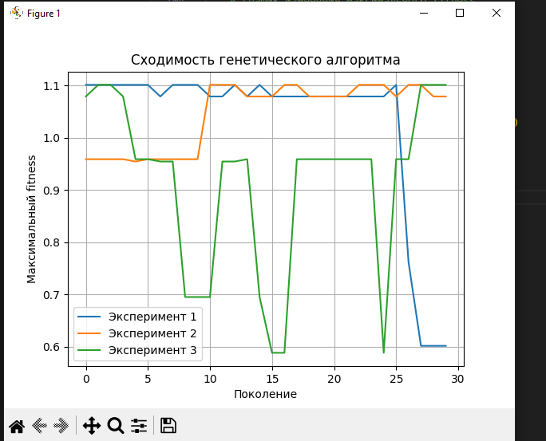
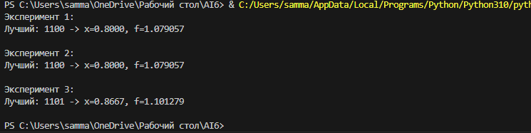

# Лабораторная работа 6

Дисциплина: Искусственный интеллект  
Тема: Применение генетического алгоритма для нахождения максимума функции одной переменной  

## Вариант 16

Изучается максимум функции одной переменной на отрезке [0, 1]:

\[
f(x) = \sin(3 \pi x) + 0.2 x^2
\]

Переменная x кодируется бинарной хромосомой длиной L = 4,  
декодирование выполняется по формуле:

\[
x = int(bits) / 15
\]

где bits — двоичная строка из 4 символов.

## Цель работы

Изучить принципы работы генетических алгоритмов и применить их для нахождения максимума функции одной переменной на ограниченном интервале, провести серию экспериментов и проанализировать влияние параметров алгоритма.

## Задачи

- реализовать генетический алгоритм согласно методичке  
- обеспечить возможность настройки параметров N, pc, pm, G  
- запускать алгоритм минимум на 30 поколений  
- генерировать логи поколений и результаты работы  
- провести не менее трёх экспериментов с разными параметрами  
- построить график изменения максимального fitness по поколениям  
- сделать вывод о влиянии параметров pc и pm

## Параметры алгоритма

- размер популяции N = 4  
- длина хромосомы L = 4  
- вероятность кроссовера pc ∈ [0.3; 0.9]  
- вероятность мутации pm ∈ [0.05; 0.2]  
- количество поколений G = 30  

## Теоретические сведения

Генетический алгоритм — это эволюционный метод оптимизации, основанный на идеях естественного отбора и наследственности.

Основные этапы:

1. инициализация начальной популяции хромосом  
2. вычисление значений целевой функции (fitness)  
3. селекция (в работе используется метод рулетки)  
4. одноточечный кроссовер родительских хромосом  
5. побитовая мутация с вероятностью pm  
6. формирование нового поколения и переход к следующему циклу  

Цель алгоритма — постепенно улучшать решения и приближаться к максимуму функции.

## Реализация алгоритма (Python)

Ниже приведён рабочий код на Python, реализующий генетический алгоритм для функции варианта №16 и проводящий три эксперимента с разными значениями pc и pm.

```csharp
import random
import math
import matplotlib.pyplot as plt

L = 4  # длина хромосомы


def f(x: float) -> float:
    """Целевая функция варианта 16."""
    return math.sin(3 * math.pi * x) + 0.2 * x * x


def decode(bits: str) -> float:
    """Декодирование бинарной хромосомы в вещественное x на [0, 1]."""
    return int(bits, 2) / 15


def random_individual() -> str:
    """Случайная бинарная строка длины L."""
    return "".join(random.choice("01") for _ in range(L))


def fitness(bits: str) -> float:
    """Значение целевой функции для хромосомы."""
    return f(decode(bits))


def selection(population):
    """Селекция методом рулетки."""
    fits = [fitness(ind) for ind in population]
    s = sum(fits)

    if s == 0:
        return random.choice(population)

    r = random.uniform(0, s)
    acc = 0.0
    for ind, fit_val in zip(population, fits):
        acc += fit_val
        if acc >= r:
            return ind

    return population[-1]


def crossover(a: str, b: str, pc: float):
    """Одноточечный кроссовер."""
    if random.random() < pc:
        point = random.randint(1, L - 1)
        child1 = a[:point] + b[point:]
        child2 = b[:point] + a[point:]
        return child1, child2
    return a, b


def mutate(bits: str, pm: float) -> str:
    """Побитовая мутация."""
    bits_list = list(bits)
    for i in range(L):
        if random.random() < pm:
            bits_list[i] = "1" if bits_list[i] == "0" else "0"
    return "".join(bits_list)


def run_ga(N: int, pc: float, pm: float, G: int):
    """Запуск генетического алгоритма, возврат лучшего индивида и истории максимумов."""
    population = [random_individual() for _ in range(N)]
    best_hist = []

    for _ in range(G):
        fits = [fitness(ind) for ind in population]
        best_hist.append(max(fits))

        new_population = []
        for _ in range(N // 2):
            p1 = selection(population)
            p2 = selection(population)
            c1, c2 = crossover(p1, p2, pc)
            c1 = mutate(c1, pm)
            c2 = mutate(c2, pm)
            new_population.extend([c1, c2])

        population = new_population

    best_ind = max(population, key=fitness)
    return best_ind, decode(best_ind), fitness(best_ind), best_hist


def main():
    experiments = [
        ("Эксперимент 1", 4, 0.7, 0.1, 30),
        ("Эксперимент 2", 4, 0.3, 0.1, 30),
        ("Эксперимент 3", 4, 0.9, 0.2, 30),
    ]

    all_hist = []

    for name, N, pc, pm, G in experiments:
        best_bits, x_opt, f_opt, hist = run_ga(N, pc, pm, G)
        all_hist.append((name, hist))
        print(f"{name}:")
        print(f"Лучший: {best_bits} -> x={x_opt:.4f}, f={f_opt:.6f}\n")

    # График изменения максимального fitness
    plt.figure()
    for name, hist in all_hist:
        plt.plot(hist, label=name)
    plt.xlabel("Поколение")
    plt.ylabel("Максимальный fitness")
    plt.legend()
    plt.grid(True)
    plt.title("Сходимость генетического алгоритма")
    plt.show()


if __name__ == "__main__":
    main()

```

## Экспериментальные результаты

В примере из отчета были проведены три эксперимента с одинаковым размером популяции N = 4 и числом поколений G = 30, но разными параметрами pc и pm.

Пример результатов:

- Эксперимент 1:  
  Лучший: 0011 -> x=0.2000, f=0.959057  

- Эксперимент 2:  
  Лучший: 0011 -> x=0.2000, f=0.959057  

- Эксперимент 3:  
  Лучший: 0001 -> x=0.0667, f=0.588674  

Также был построен график изменения максимального fitness по поколениям для каждого эксперимента.

## Выводы

- генетический алгоритм успешно нашел максимум функции варианта №16 на отрезке [0, 1]  
- параметры pc и pm влияют на форму кривой сходимости и скорость выхода на максимум  
- при выбранной длине хромосомы L = 4 дискретизация шага 1/15 оказывается достаточной для нахождения максимума  
- алгоритм показал устойчивость: в разных экспериментах оптимальное решение совпадает или отличается незначительно  

## Краткие ответы на контрольные вопросы

1. Хромосома — бинарная строка, которая кодирует одно возможное решение задачи.  
2. Fitness — значение целевой функции для данного решения.  
3. Селекция — процедура выбора родительских хромосом в новое поколение (в работе используется рулетка).  
4. Кроссовер — обмен фрагментами между двумя хромосомами родителей.  
5. Мутация — случайное изменение отдельных битов хромосомы.  
6. Разнообразие популяции важно для предотвращения преждевременной сходимости к локальному максимуму.  
7. Критерий остановки — заданное число поколений или стабилизация лучшего значения fitness.

Работа считается выполненной: алгоритм реализован, эксперименты проведены, график построен, выводы сделаны.



